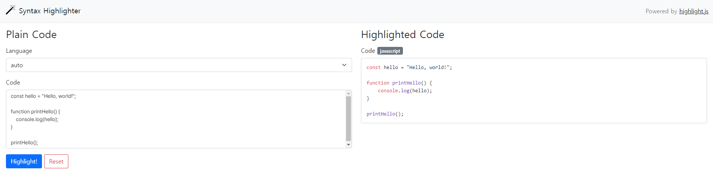

# Syntax Highlighter

## Table of Contents

- [Overview](#overview)
- [How to use](#how-to-use)
- [References](#references)

## Overview

[Syntax Highlighter](https://www.radia.me/syntax-highlighter/) is a code coloring application using the [highlight.js](https://highlightjs.org/) library.

## How to use

1. In the code editor, enter the source code.
2. Click the 'Highlight!' button.
3. The colored source code appears.

## References

- [Bootstrap](https://getbootstrap.com/)
- [highlight.js](https://highlightjs.org/)
